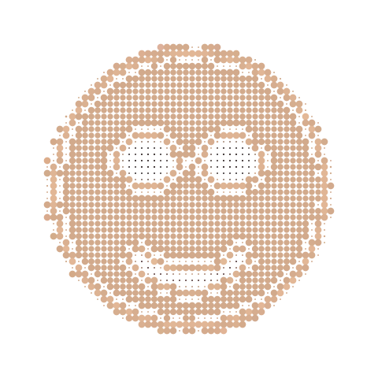
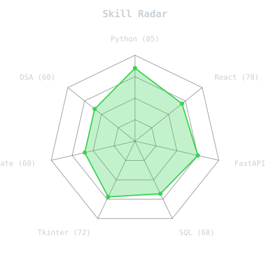
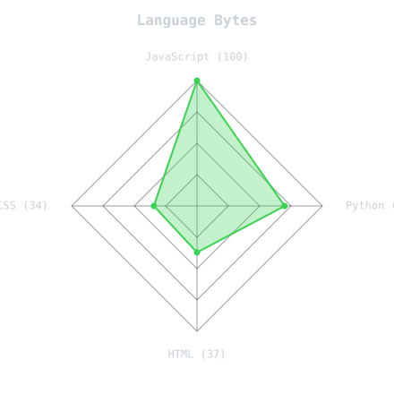
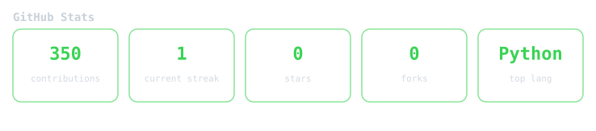
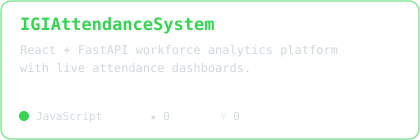
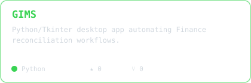
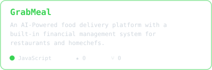
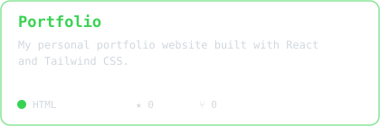

<div align="center">

<p align="center">

</p>

<p align="center">

</p>

<p align="center">
<a href="https://linkedin.com/in/taha-sheikh-a3520921a"></a>
&nbsp;&nbsp;
<a href="mailto:tahasheikh30@gmail.com"></a>
&nbsp;&nbsp;
<a href="https://taha-ahmed-sheikh.vercel.app"></a>
</p>

<p align="center">

</p>

</div>

## `~/` whoami

```console
$ cat about.txt
```

Hi, I'm **Taha Ahmed Sheikh**. One or two lines about what you build and why.

- Currently building **[GIMS](https://github.com/tahasheikh30/GIMS)**
- Learning **Project Management**
- Fun fact: **The easiest way to impress me is by buying me dessert**

<div align="center">

</div>

## Skills

<table><tr>
<td width="50%" align="center">
<picture>
  <source media="(prefers-color-scheme: dark)" srcset="assets/radar-dark.svg">
  <source media="(prefers-color-scheme: light)" srcset="assets/radar-light.svg">
  
</picture>
</td>
<td width="50%" align="center">
<picture>
  <source media="(prefers-color-scheme: dark)" srcset="assets/radar-langs-dark.svg">
  <source media="(prefers-color-scheme: light)" srcset="assets/radar-langs-light.svg">
  
</picture>
</td>
</tr></table>

## Activity

<div align="center">


</div>

## Stats

<div align="center">
<picture>
  <source media="(prefers-color-scheme: dark)" srcset="assets/stats-dark.svg">
  <source media="(prefers-color-scheme: light)" srcset="assets/stats-light.svg">
  
</picture>


<picture>
  <source media="(prefers-color-scheme: dark)" srcset="assets/metrics.achievements-dark.svg">
  <source media="(prefers-color-scheme: light)" srcset="assets/metrics.achievements-light.svg">
  
</picture>
</div>

## Projects

<table>
<tr>
<td width="50%">
<a href="https://github.com/tahasheikh30/IGIAttendanceSystem">
<picture>
  <source media="(prefers-color-scheme: dark)" srcset="assets/card-IGIAttendanceSystem-dark.svg">
  <source media="(prefers-color-scheme: light)" srcset="assets/card-IGIAttendanceSystem-light.svg">
  
</picture>
</a>
</td>
<td width="50%">
<a href="https://github.com/tahasheikh30/GIMS">
<picture>
  <source media="(prefers-color-scheme: dark)" srcset="assets/card-GIMS-dark.svg">
  <source media="(prefers-color-scheme: light)" srcset="assets/card-GIMS-light.svg">
  
</picture>
</a>
</td>
</tr>
<tr>
<td width="50%">
<a href="https://github.com/tahasheikh30/GrabMeal">
<picture>
  <source media="(prefers-color-scheme: dark)" srcset="assets/card-GrabMeal-dark.svg">
  <source media="(prefers-color-scheme: light)" srcset="assets/card-GrabMeal-light.svg">
  
</picture>
</a>
</td>
<td width="50%">
<a href="https://github.com/tahasheikh30/Portfolio">
<picture>
  <source media="(prefers-color-scheme: dark)" srcset="assets/card-Portfolio-dark.svg">
  <source media="(prefers-color-scheme: light)" srcset="assets/card-Portfolio-light.svg">
  
</picture>
</a>
</td>
</tr>
</table>

<div align="center">

| Project | Stack | Link |
|:--|:--|:--:|
| **IGIAttendanceSystem** |   | [repo](https://github.com/tahasheikh30/IGIAttendanceSystem) |
| **GIMS** |   | [repo](https://github.com/tahasheikh30/GIMS) |
| **GrabMeal** |    | [repo](https://github.com/tahasheikh30/GrabMeal) |
| **Portfolio** |   | [repo](https://github.com/tahasheikh30/Portfolio) |

</div>
